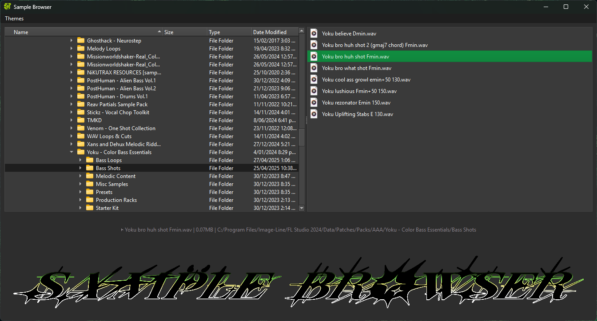
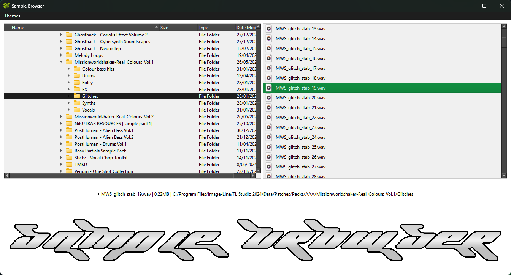

# Sample-Browser

**Sample Browser** is a Python-based desktop application built with PyQt6, designed for music producers working across multiple DAWs. It enables efficient audio file browsing, previewing, and management, featuring an intuitive and customizable interface with support for visual themes and persistent settings.

---

# Characteristics

- **File Explorer**: Navigate your file system using tree and list views.
- **Audio Preview**: Play supported audio files directly within the application.
- **Multi-Format Support**: Compatible with `.wav`, `.mp3`, `.aif`, and `.flac` formats.
- **Customizable Interface**: Switch visual themes and save settings such as the last opened directory, window geometry, and panel states.
- **Drag and Drop**: Supports dragging files directly from the file list.
- **Theme Loader**: Customize the app's appearance with visual styles.

---

# System Requirements

- **Operating System**: Windows 10/11 (64-bit)
- **Python**: Version 3.9 or higher
- **Dependencies**:
  - PyQt6

---

# Installation

### Option 1: Executable (Recommended)
1. Download the installer from [https://github.com/AlejandroJIMBUI/Sample-Browser/releases/tag/v1.0].
2. Run the installer and follow the on-screen instructions.
3. Once installed, launch the application from the Start menu.

### Option 2: Source Code Installation
1. Clone this repository using the following command:
   ```bash
   git clone https://github.com/AlejandroJIMBU/Sample-Browser.git
   cd sample-browser
   ```
2. Create a Virtual Environment and Install Dependencies:
   ```bash
   python -m venv venv
   venv\Scripts\activate
   pip install -r requirements.txt
   ```
3. Run the Application:
   ```bash
   python src/main.py
   ```

---

# Images

### Theme: dark


### Theme: Light


Future releases will introduce new themes and additional features

---

# Usage

1. Upon launching the application, select a directory using the built-in file explorer.
2. Preview audio files by clicking on them.
3. Customize your experience through the settings menu to:
   - Switch visual themes
   - Adjust application preferences
4. Drag and drop files directly from the file list to external applications.

---

# Development

### Setting Up the Development Environment
1. Install Development Dependencies
   ```bash
   pip install -r requirements.txt
   ```
2. Running Unit Tests
   ```bash
   pytest
   ```

### Building the Application
**Generating Executables with PyInstaller**:
```bash
pyinstaller --onefile --windowed main.py
```

### Key Build Options:
- `--onefile`: Single executable output
- `--windowed`: Prevent console window display (GUI apps)
- `--name`: Set output application name
- `--icon`: Specify application icon
- `--add-data`: Include additional resource files

### Post-Build Verification:
- Check generated files in /dist directory
- Test executable functionality
- Validate resource inclusion

---

# Downloads

### Windows Installer: [https://github.com/AlejandroJIMBUI/Sample-Browser/releases/tag/v1.0]

